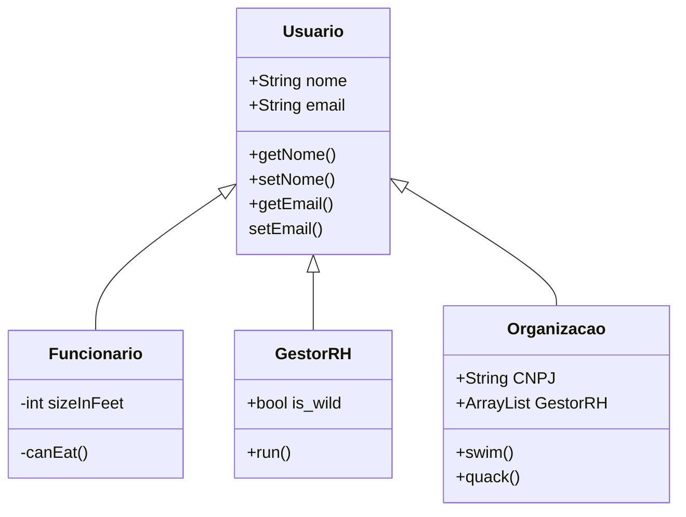
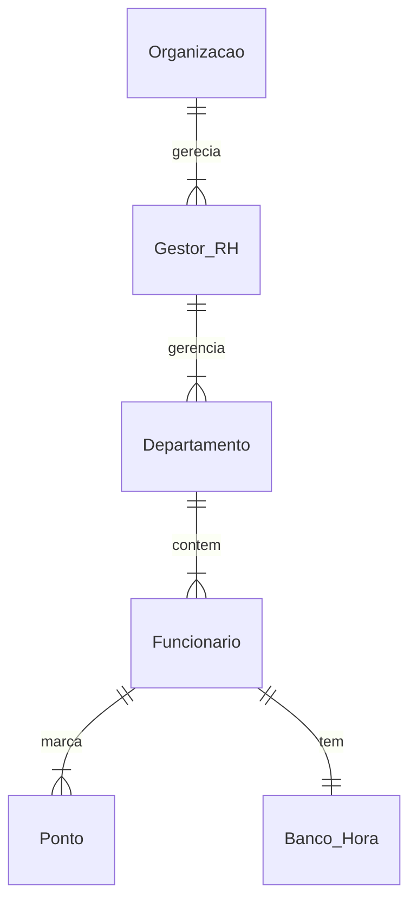

# Documento de Modelos
Neste documento temos o modelo Conceitual (UML) de dados e de Dados (Entidade-relacionamento). Temos também a descrição das entidades e o dicionário de dados.

Para a modelagem pode se usar a ferramenta Astah UML ou o BrModelo. Além dessas, a ferramenta **Mermaid** é usada para a geração de diagramas diretamente no arquivo MarkDown (.md) [ver mais.](https://github.blog/2022-02-14-include-diagrams-markdown-files-mermaid/).

## Modelos Conceitual

### Diagrama de Classes usando o Mermaid

### Diagrama de Dados (Entidade-Relacionamento)

Para criar esse modelo, usamos a ferramenta [Mermaid](https://mermaid.js.org/) seguindo o tutorial [deste site](https://mermaid.js.org/syntax/entityRelationshipDiagram.html)

