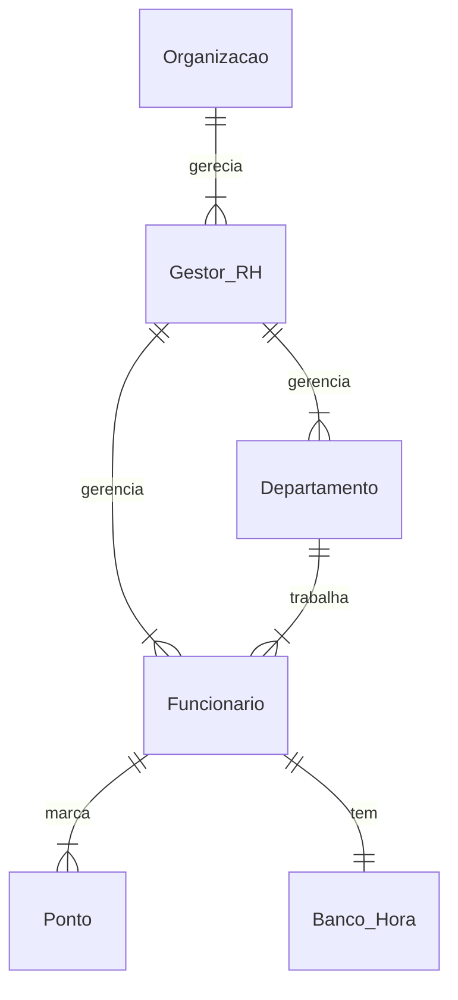

# Documento de Modelos

Neste documento temos o modelo Conceitual (UML) de dados e de Dados (Entidade-relacionamento). Temos também a descrição das entidades e o dicionário de dados.

Para a modelagem pode se usar a ferramenta Astah UML ou o BrModelo. Além dessas, a ferramenta **Mermaid** é usada para a geração de diagramas diretamente no arquivo MarkDown (.md) [ver mais.](https://github.blog/2022-02-14-include-diagrams-markdown-files-mermaid/).


## Modelos Conceitual

### Diagrama de Classes usando o Mermaid

```mermaid
classDiagram
    class Organizacao{
        +String nome
        +String cnpj
        +String proprietario
        +String cpf_proprietario
        +Date data_criacao
        +List~Departamento~ Departamentos
        +List~Gestor~ Gestor

        +getNome() string
        +setNome() void
        +getCnpj() string
        +setCnpj() void
        +getproprietario() string
        +setProprietario() void
        +getCpfProprietario() string
        +setCpfProprietario() void

        +createUser( ) Gestor
        +searchUser(String cpf) Gestor
        +updateUser(String cpf) void
        +deleteUser(String cpf) boolean

        +createDepto( ) Depto
        +searchDepto(Int codigo) Depto
        +updateDepto(Int codigo) void
        +deleteDepto(Int codigo) boolean
    }

    class Depto{
        +String nome
        +int codigo
        +Date data_criacao

        +getNome() string
        +setNome() void
        +getCodigo() int
        +setCodigo() void
        +getDataCriacao() string
        +setDataCriacao() void
    }

    class Usuario{
        +String nome
        +String cpf
        +String sexo
        +Date data_Nasc
        +boolean isAdmin
        +int codigo_depto
        +String turno
        +String email
        +String senha
        +List~Ponto~ pontos

        +getNome() string
        +setNome() void
        
        +getCpf() string
        +setCpf() void
        
        +getSexo() string
        +setSexo() void
        
        +getDataNasc() Date
        +setDataNasc() void
        
        +getTurno() string
        +setTurno() void
        
        +getEmail() string
        +setEmail() void
        
        +getSenha() string
        +setSenha() void
        
        +getAdmin() boolean
        +setAdmin() void

        +verificarLogin() boolean
        +recuperarAcesso( String email ) boolean 

        +marcarPonto( Date data) : Ponto ponto_marcado
        +emitirComprovante ( Ponto ponto) : String
        +listarPontos({Date periodo}) List~Ponto~ pontos
        +bancoHoras() int
        +solicitarBeneficio( ) string
    }

    class Gestor{
        +List~Departamento~ departamento
        +List~Funcionario~ funcionario

        +createUser( ) Funcionario
        +searchUser(String cpf) Funcionario
        +updateUser(String cpf) void
        +deleteUser(String cpf) boolean

        +createDepto( ) Depto
        +searchDepto(Int codigo) Depto
        +updateDepto(Int codigo) void
        +deleteDepto(Int codigo) boolean

        +gerarRelatorio(Date periodo) List~Funcionario~ funcionario
        +corrigirPonto( Funcionario funcionario, Date data) : Ponto ponto_corrigido
        +listarDeptos() List~Deptos~ departamentos

        +listarPontos({Date periodo}, {Funcionario funcionario}) List~Ponto~ pontos

    }

    class Funcionario{
        +listarDeptos() List~Deptos~ departamentos
    }
```
### Diagrama de Dados (Entidade-Relacionamento)

Para criar esse modelo, usamos a ferramenta [Mermaid](https://mermaid.js.org/) seguindo o tutorial [deste site](https://mermaid.js.org/syntax/entityRelationshipDiagram.html)





