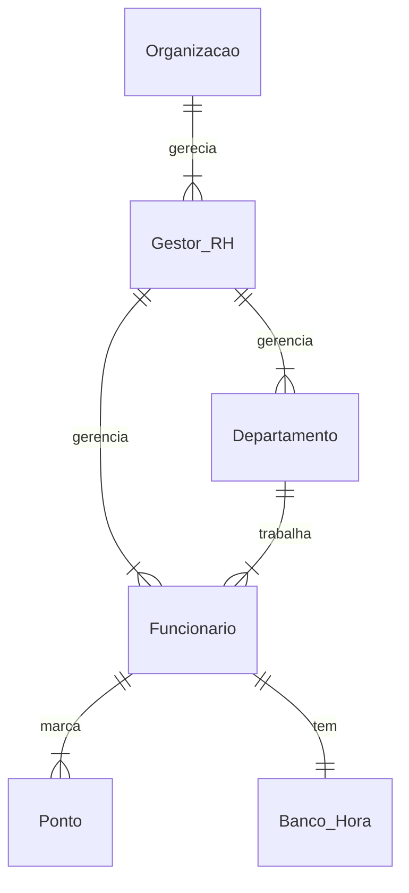

# Documento de Modelos

Neste documento temos o modelo Conceitual (UML) de dados e de Dados (Entidade-relacionamento). Temos também a descrição das entidades e o dicionário de dados.

Para a modelagem pode se usar a ferramenta Astah UML ou o BrModelo. Além dessas, a ferramenta **Mermaid** é usada para a geração de diagramas diretamente no arquivo MarkDown (.md) [ver mais.](https://github.blog/2022-02-14-include-diagrams-markdown-files-mermaid/).

## Modelos Conceitual

### Diagrama de Classes usando o Mermaid
Para criar esse diagrama, utilizamos a ferramenta [LucidChart](https://www.lucidchart.com/blog/pt) e importamos o projet oem formato de imagem PNG.

|Entidade       | Descrição                                            |
|---------------|------------------------------------------------------|
|Organização | Entidade que representa a organização/empresa. Apresenta dados relacionados à empresa bem como relacionado ao dono. Pode gerenciar outros funcionarios e departamentos.|
|Gestor | Entidade do tipo 'funcionário' com permissão administrativa, ou seja, pode gerenciar outros funcionários.|
|Funcionario | Entidade do tipo não-administrador, ou eja, não gerencia outros usuários. Essa categoria apenas realiza ações básicas.|
|Departamento | Entidade que representa os departamentos de uma organização. Usuários da categoria: Organização e Gestor controlam essa entidade.|
|Login | Entidade responsável pela realização e autenticação de informações relacionadas ao login na plataforma.|
|Ponto | entidade que realiza ações básicas de marcação de pontos.
|Gerenciar | Entidade Abstrata que intercala as funções gerais de gerenciamento (CRUD) dos usuários do sistema.|

### Diagrama de Dados (Entidade-Relacionamento)

Para criar esse modelo, usamos a ferramenta [Mermaid](https://mermaid.js.org/) seguindo o tutorial [deste site](https://mermaid.js.org/syntax/entityRelationshipDiagram.html)

### Dicionário de Dados

#### Organização
Tabela | Organização
Descrição | Armazena as informações referentes à organização.

| nome      | Descrição     | Tipo de dado  | Tamanho | Restrições de domínio |
|-----------|---------------|---------------|---------|---------------|
|  nome     | Nome da org.  | VARCHAR       |  50 | Not Null   |
|  cnpj     | CNPJ da org.  | VARCHAR       |  14 |     PK     |
|  cpf_dono | CPF do dono   | VARCHAR       |  11 |   Not Null |
|proprietario| Nome do proprietario| VARCHAR| 100 | Not Null   |
| data_criacao| Data de criacao| DATE       | --- | ---        |

#### Gestor

Tabela | Gestor
Descrição| Armazena informações de usuários gestores
