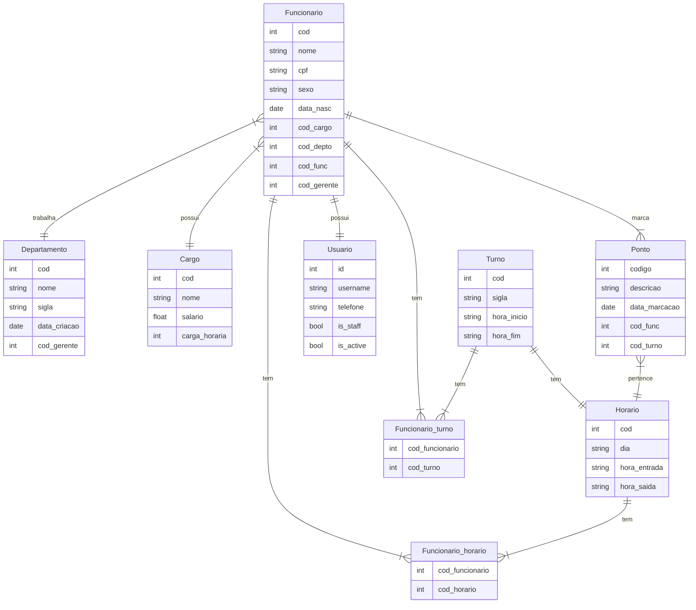

# Documento de Modelos
Neste documento temos o modelo Conceitual (UML) de dados e de Dados (Entidade-relacionamento). Temos também a descrição das entidades e o dicionário de dados.

Para a modelagem pode se usar a ferramenta Astah UML ou o BrModelo. Além dessas, a ferramenta **Mermaid** é usada para a geração de diagramas diretamente no arquivo MarkDown (.md) [ver mais.](https://github.blog/2022-02-14-include-diagrams-markdown-files-mermaid/).

## Modelos Conceitual

### Diagrama de Classes usando o Mermaid
[Descrição]

>Em breve.

#### Tabela de Descrição

Essa tabela visa descrever de forma breve e objetiva cada entidade do sistema.

|Entidade       | Descrição                                            |
|---------------|------------------------------------------------------|
|Organização | Entidade que representa a organização/empresa. Apresenta dados relacionados à empresa bem como relacionado ao dono. Pode gerenciar outros funcionarios e departamentos.|
|Gestor | Entidade do tipo 'funcionário' com permissão administrativa, ou seja, pode gerenciar outros funcionários.|
|Funcionario | Entidade do tipo não-administrador, ou eja, não gerencia outros usuários. Essa categoria apenas realiza ações básicas.|
|Departamento | Entidade que representa os departamentos de uma organização. Usuários da categoria: Organização e Gestor controlam essa entidade.|
|Login | Entidade responsável pela realização e autenticação de informações relacionadas ao login na plataforma.|
|Ponto | entidade que realiza ações básicas de marcação de pontos.
|Gerenciar | Entidade Abstrata que intercala as funções gerais de gerenciamento (CRUD) dos usuários do sistema.|

### Diagrama de Dados (Entidade-Relacionamento)

Para criar esse modelo, usamos a ferramenta [Mermaid](https://mermaid.js.org/) seguindo o tutorial [deste site](https://mermaid.js.org/syntax/entityRelationshipDiagram.html)

### Dicionário de Dados

#### Funcionario

|Tabela     | Funcionario                                               |
|-----------|-----------------------------------------------------------|
|Descrição  | Armazena informações de usuários da categoria Funcionario/Gestor.|

| nome      | Descrição     | Tipo de dado  | Tamanho | Restrições de domínio |
|-----------|---------------|---------------|---------|-----------------|
| cod       |Gerado pelo SGBD| SERIAL       | --     | PRIMARY KEY     |
| cpf       | cpf do usuario| VARCHAR       | 11      | NOT NULL UNIQUE |
| sexo      | Sexo do usuario | VARCHAR     | 1       | ---             |
| data_Nasc | Data de nascimento| DATE      | ---     | NOT NULL      |
|cod_gerente| Identific. Gerente| INT       | ---     | FOREIGN KEY   |
|cod_depto| Identific. Departamento| INT    | ---     | FOREiGN KEY   |
|cod_cargo| Identific. Cargo    | INT       | ---     | FOREiGN KEY   |

### Usuario

|Tabela     | Usuario                                               |
|-----------|-----------------------------------------------------------|
|Descrição  | Armazena informações de acesso dos usuários.|

| nome      | Descrição     | Tipo de dado  | Tamanho | Restrições de domínio |
|-----------|---------------|---------------|---------|-----------------|
| cod       |Gerado pelo SGBD| SERIAL       | --      | PRIMARY KEY     |
| usuario   | cpf do usuario| VARCHAR       | 12      | NOT NULL UNIQUE |
| email     | Sexo do usuario| VARCHAR      | 30      | NOT NULL        |
| senha     | Data de nascimento| VARCHAR   | ---     | NOT NULL        |
|token      | var de Autenticacao| VARCHAR   | ---     | NOT NULL        |
|cod_func   | Identific. Funcionario| INT   | ---     | FOREIGN KEY     |

#### Departamento

|Tabela     |  Departamento                                            |
|-----------|----------------------------------------------------------|
|Descrição  | Armazena informações de departamentos.                   |

| nome      | Descrição     | Tipo de dado  | Tamanho | Restrições de domínio |
|-----------|---------------|---------------|---------|---------------|
| cod       |Gerado pelo SGBD| SERIAL       | --     | PRIMARY KEY    |
| nome      |Nome do Departamento| VARCHAR  | 50      | NOT NULL      |
| sigla      |Sigla do Departamento| VARCHAR| 10      | NOT NULL      |
| data_criacao| Data criação | DATE         |   ---     | NOT NULL    |
| cod_gerente| Identific. Gerente| INT       | ---     | FOREIGN KEY   |

#### Ponto

|Tabela     |  Ponto                                                  |
|-----------|---------------------------------------------------------|
|Descrição  | Armazena informações relacionadas aos pontos marcados pelso usuários.|

| nome      | Descrição     | Tipo de dado  | Tamanho | Restrições de domínio |
|-----------|---------------|---------------|---------|---------------|
| cod       |Gerado pelo SGBD| SERIAL       | --     | PRIMARY KEY    |
| descricao    |  Descrição da marcação| String   | 100      | ---    |
| data_Marcacao | data registrada| DATE     | ---     | NOT NULL      |
| cod_func| Identific. funcionario| INT       | ---     | FOREIGN KEY |
| cod_turno| Identific. Turno| INT       | ---     | FOREIGN KEY   |

#### Cargo

|Tabela     |  Cargo                                                  |
|-----------|---------------------------------------------------------|
|Descrição  | Armazena informações relacionadas aos cargos existentes na organização.|

| nome      | Descrição     | Tipo de dado  | Tamanho | Restrições de domínio |
|-----------|---------------|---------------|---------|---------------|
| cod       |Gerado pelo SGBD| SERIAL       | --     | PRIMARY KEY    |
| nome      | Título do cargo| String       | 30     | NOT NULL       |
| salario   | Numérico.     | float         | ---    | NOT NULL       |
| carga_horaria | carga horaria| int        | ---    | NOT NULL       |

#### Turno

|Tabela     |  Turno                                                  |
|-----------|---------------------------------------------------------|
|Descrição  | Armazena informações relacionadas aos turnos de trabalho da organização.|

| nome      | Descrição     | Tipo de dado  | Tamanho | Restrições de domínio |
|-----------|---------------|---------------|---------|---------------|
| cod       |Gerado pelo SGBD| SERIAL       | --      | PRIMARY KEY   |
| sigla     | Sigla do turno| String        | 1       | NOT NULL      |
| hora_inicio| Horario do turno| String   | 10       | NOT NULL       |
| hora_fim  | Horario do turno| String   | 10       | NOT NULL        |

#### Funcionario_turno

|Tabela     |  Funcionario_turno                                      |
|-----------|---------------------------------------------------------|
|Descrição  | Armazena informações relacionadas à relação Funcionario-turno.|

| nome      | Descrição     | Tipo de dado  | Tamanho | Restrições de domínio |
|-----------|---------------|---------------|---------|---------------|
| cod_func |Identific. funcionario| INT       | --      | PRIMARY KEY FOREIGN KEY|
| cod_turno |Identific. turno| INT       | --      | PRIMARY KEY FOREIGN KEY|

#### Funcionario_horario

|Tabela     |  Funcionario_horario                                    |
|-----------|---------------------------------------------------------|
|Descrição  | Armazena informações relacionadas à relação Funcionario_horario.|

| nome      | Descrição     | Tipo de dado  | Tamanho | Restrições de domínio |
|-----------|---------------|---------------|---------|---------------|
| cod_func |Identific. funcionario| INT       | --      | PRIMARY KEY FOREIGN KEY|
| cod_horario |Identific. horario| INT       | --      | PRIMARY KEY FOREIGN KEY|

#### Horario

|Tabela     |  Horario                                    |
|-----------|---------------------------------------------------------|
|Descrição  | Armazena informações relacionadas aos horários dos pontos marcados.|

| nome      | Descrição     | Tipo de dado  | Tamanho | Restrições de domínio |
|-----------|---------------|---------------|---------|---------------|
| cod       |Gerado pelo SGBD| SERIAL       | --      | PRIMARY KEY   |
| dia       | Dia marcado   | String       | ---     | NOT NULL       |
| hora_entrada| hora de entrada marcada   | String       | ---     | NOT NULL|
| hora_saida| hora de saida marcada   | String       | ---     | NOT NULL|
| cod_horario |Identific. horario| INT       | --      | PRIMARY KEY FOREIGN KEY|
