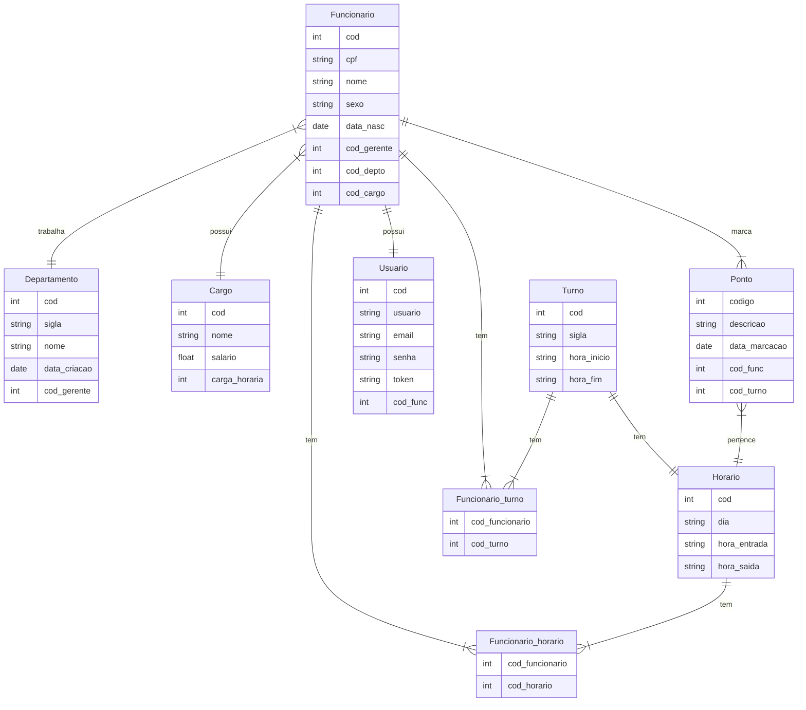

# Documento de Visão

Documento construído a partir do **Modelo BSI - Doc 001 - Documento de Visão** que pode ser encontrado no
link: https://docs.google.com/document/d/1DPBcyGHgflmz5RDsZQ2X8KVBPoEF5PdAz9BBNFyLa6A/edit?usp=sharing

## Equipe e Definição de Papéis

Membro     |     Papel   |   E-mail   |
---------  | ----------- | ---------- |
Bruno Porfírio | Gerente, Desenvolvedor  | bruno.costa.079@.ufrn.edu.br
David Emanoel  | Desenvolvedor| david.emanoel.706@ufrn.edu.br
Marcelo Victor | Desenvolvedor, Analista | marcelo.victor.100@ufrn.edu.br
Renan Vale     | Analista, Testador | renan.vale.072@ufrn.edu.br

### Matriz de Competências

Membro     |     Competências   |
---------  | ----------- |
Bruno Porfírio | Desenvolvedor Web-Apps, sites, python, ReactJs | 
David Emanoel  | Desenvolvedor Back-end, API REST (django), ReactJs;| 
Marcelo Victor | Desenvolvedor Front-end, UX/UI | 
Renan Vale     | Product Manager, Dev. python, Dev.  C. |

## Perfis dos Usuários

O sistema poderá ser utilizado por diversos usuários. Temos os seguintes perfis/atores:

Perfil                                 | Descrição   |
---------                              | ----------- |
Gestor | Esse tipo de usuário terá acesso à funções gerenciais no sistema, podendo cadastrar e gerenciar outros usuários na categoria Gerente do seu negócio.
Gerente | Esse tipo de usuário terá acesso às funções gerenciais no sistema, podendo cadastrar e gerenciar outros usuários na categoria Funcionário, gerenciar departamentos, gerar relatórios e gerenciar banco de horas.
Funcionários | Esse tipo de usuário terá apenas acesso ao sistema para a realização de tarefas básicas como: Alterar dados pessoais e de acesso, marcar ponto e acompanhar histórico de pontos. Será utilizado por trabalhadores/funcionários de uma determinada organização. Este usuário só poderá utilizar o sistema caso algum superior (usuário Adm) o tenha cadastrado previamente.

## Lista de Requisitos Funcionais

Requisito  | Descrição   | Ator |
 --------- | ----------- | ---- |
RF01 - Cadastrar Usuários |  Informar dados cadastrais e criar novo registro de usuário no banco de dados. Na criação, será informado: nome, cpf, data de nascimento, sexo, cargo: tipo gerente(quem cadastra é o gestor) e tipo funcionário(quem cadastra é o gerente), código do departamento, turno, e-mail e senha. | Gestor, Gerente |
RF02 - Visualizar Usuários | Requisição ao banco de dados retornando todos os usuários ativos. | Gestor, Gerente |
RF03 - Inativar usuários | Inativar registro do usuário, impossibilitando seu login no sistema. | Gestor, Gerente |
RF04 - Alterar Dados do usuário | Poderá ser editado os dados: nome, cargo, turno, departamento, e-mail e senha. | Gestor, Gerente |
RF06 - Realizar Login | Usuários poderão realizar login na plataforma utilizando e-mail/cpf e senha já cadastrados previamente. | Todos os usuários cadastrados |
RF07 - Recuperar Acesso | Na tela de login haverá uma opção de recuperar dados, o usuário informa seu e-mail e recebe uma notificação com um link para inserir suas novas credenciais. | Todos os usuários cadastrados |
RF07 - Cadastrar Departamento | Criação de um novo registro de departamento, informando os dados: nome, sigla, data de criação e código do gerente. | Gestor |
RF08 - Listar departamento | Será listado, em ordem alfabética, todos os departamentos cadastrados em sua organização, bem como todos os membros vinculados a ele. | Gestor e Gerente |
RF09 - Inativar Departamento | Será inativado o departamento no registro do banco de dados. Quando da inativação, todos os usuários que referenciam esse campo ficarão com o campo código do departamento: null. | Gerente e Gestor |
RF10 - Alterar dados  do Departamento | Será possível alterar: nome, sigla e código do gerente. Quando da alteração, todos os usuários que referenciam este departamento terão seu campo departamento atualizado com o novo valor. | Gestor |
RF11 - Visualizar Departamentos | O Usuário poderá visualizar todos os funcionários de seu departamento, bem como todos os departamentos da organização. | Todos os atores |
RF12 - Marcar ponto | Usuários poderão contabilizar a jornada de trabalho. Será criado um registro no banco de dados desse ponto, com a hora calculada da seguinte forma: hora_trabalhada = ( (Saída_turno1 - Entrada_turno1) + ( Saída_turno2 - Entrada_turno2) ). | Funcionário e Gerente |
RF13 - Emitir comprovante | Durante a marcação de ponto, será gerado um comprovante digital da marcação do ponto contendo: Data, hora, código de marcação. | Funcionário e Gerente |
RF14 - Justificar ausência | Usuários poderão solicitar, a justificativa de ausência de marcação de ponto, informando uma breve descrição (Ponto.descrição) e um anexo comprobatório. O Gerente poderá aprovar essa solicitação, a fim de melhor controle. | Funcionário e Gerente|
RF15 - Acompanhar Histórico | O usuário poderá solicitar o histórico dos seus pontos marcados, podendo filtrá-los por data. Além disso, o comprovante de marcação será exibido para download. | Funcionário e Gerente|
RF16 - Gerar relatório | O Gerente poderá gerar um relatório completo com detalhes de cada ponto marcado pelos usuários ao longo de um determinado período. | Gerente |
RF17 - Corrigir a marcação de ponto | O Gerente poderá fazer a correção no ponto do Funcionário, editando o atributo: Ponto.descrição. | Gerente e Gestor |
RF18 - Solicitar Benefício de Hora | O Funcionário poderá solicitar, de acordo com o status do banco de horas (crédito ou débito) um benefício a ser negociado com o gerente, dependendo do regimento interno de cada organização. | Funcionário e Gerente|
RF19 - Gerenciar Benefício de hora. | O Gerente poderá aceitar ou não a solicitação de benefício de hora requisitada por um Funcionário. | Gerente |

### Modelo Conceitual

Abaixo apresentamos o modelo conceitual. Veja melhor em: [documento de modelos]().

#### Descrição das Entidades

## Lista de Requisitos Não-Funcionais

Requisito                                 | Descrição   |
---------                                 | ----------- |
RNF01 - Deve ser acessível via navegador | Deve abrir perfeitamento no Browser. |
RNF02 - Deve rodar em Windows, Linux e MacOS. | O sistema deve executar qualquer navegador destes sistemas operacionais |
RNF03 - Deve ser feito o log de ações dos usuários. | Deve manter um log de todos os acessos e das funções executadas pelo usuário |

## Riscos

Tabela com o mapeamento dos riscos do projeto, as possíveis soluções e os responsáveis.

Data | Risco | Prioridade | Responsável | Status | Providência/Solução |
------ | ------ | ------ | ------ | ------ | ------ |
01/12/2022 | Não aprendizado das ferramentas utilizadas pelos componentes do grupo | Alta | Todos | Vigente | Reforçar estudos sobre as ferramentas e aulas com a integrante que conhece a ferramenta |
01/12/2022 | Ausência por qualquer motivo do cliente | Média | Gerente | Vigente | Planejar o cronograma tendo em base a agenda do cliente |
01/12/2022 | Divisão de tarefas mal sucedida | Baixa | Gerente | Vigente | Acompanhar de perto o desenvolvimento de cada membro da equipe |
01/12/2022 | Probabilidade de queda do sistema | Média | Gerente | Resolvido | Reiniciar o sistema, contatar a equipe para verificar a origem do problema e corrigi-lo. |
07/05/2023 | Atraso no conograma de entrega | Baixa | Gerente | Vigente | Reorganizar a equipe com o intuito de entregar as funcionalidades no prazo definido. |
07/05/2023 | Não implementação do benefício de horas | Alta | Desenvolvedores | Vigente | Fazer esforço pra tentar entregar as funcionalidades. |
07/05/2023 | Não conclusão do projeto. | Alta | Desenvolvedores | Vigente | Fazer esforço pra tentar entregar as funcionalidades. |

### Referências
Características e definição
 
[Link](https://www.pontotel.com.br/sistema-de-ponto/)
